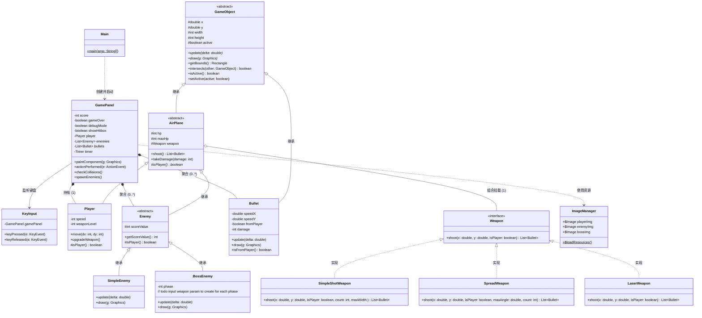

```mermaid
classDiagram
    %% ======= 核心/控制层 =======
    class Main {
        +main(args: String[]) $
    }

    class GamePanel {
        -int score
        -boolean gameOver
        -boolean debugMode
        -boolean showHitbox
        -Player player
        -List~Enemy~ enemies
        -List~Bullet~ bullets
        -Timer timer
        +paintComponent(g: Graphics)
        +actionPerformed(e: ActionEvent)
        +checkCollisions()
        +spawnEnemies()
    }

    class KeyInput {
        -GamePanel gamePanel
        +keyPressed(e: KeyEvent)
        +keyReleased(e: KeyEvent)
    }

    %% ======= 基础实体与接口 =======
    class GameObject {
        <<abstract>>
        #double x
        #double y
        #int width
        #int height
        #boolean active
        +update(delta: double)*
        +draw(g: Graphics)*
        +getBounds() Rectangle
        +intersects(other: GameObject) boolean
        +isActive() boolean
        +setActive(active: boolean)
    }

    class AirPlane {
        <<abstract>>
        #int hp
        #int maxHp
        #Weapon weapon
        +shoot() List~Bullet~
        +takeDamage(damage: int)
        #isPlayer()* boolean
    }

    %% ======= 飞机派生类 =======
    class Player {
        -int speed
        -int weaponLevel
        +move(dx: int, dy: int)
        +upgradeWeapon()
        #isPlayer() boolean
    }

    class Enemy {
        <<abstract>>
        #int scoreValue
        +getScoreValue() int
        #isPlayer() boolean
    }

    class SimpleEnemy {
        +update(delta: double)
        +draw(g: Graphics)
    }

    class BossEnemy {
        -int phase
        // todo input weapon param to create for each phase
        +update(delta: double)
        +draw(g: Graphics)
    }

    %% ======= 子弹实体 =======
    class Bullet {
        -double speedX
        -double speedY
        -boolean fromPlayer
        -int damage
        +update(delta: double)
        +draw(g: Graphics)
        +isFromPlayer() boolean
    }

    %% ======= 武器与弹幕策略 =======
    class Weapon {
        <<interface>>
        +shoot(x: double, y: double, isPlayer: boolean) List~Bullet~
    }

    class SimpleShotWeapon {
        +shoot(x: double, y: double, isPlayer: boolean, count: int, maxWidth: ) List~Bullet~
    }

    class SpreadWeapon {
        +shoot(x: double, y: double, isPlayer: boolean, maxAngle: double, count: int) List~Bullet~
    }

    class LaserWeapon {
        +shoot(x: double, y: double, isPlayer: boolean) List~Bullet~
    }

    %% ======= 静态资源管理 =======
    class ImageManager {
        +$Image playerImg
        +$Image enemyImg
        +$Image bossImg
        +$loadResources()$
    }

    %% ======= 关系映射 (Relationships) =======
    Main ..> GamePanel : 创建并启动
    GamePanel *-- Player : 持有 (1)
    GamePanel *-- Enemy : 聚合 (0..*)
    GamePanel *-- Bullet : 聚合 (0..*)
    GamePanel --> KeyInput : 监听键盘

    GameObject <|-- AirPlane : 继承
    GameObject <|-- Bullet : 继承

    AirPlane <|-- Player : 继承
    AirPlane <|-- Enemy : 继承

    Enemy <|-- SimpleEnemy : 继承
    Enemy <|-- BossEnemy : 继承

    AirPlane o-- Weapon : 组合挂载 (1)

    Weapon <|.. SimpleShotWeapon : 实现
    Weapon <|.. SpreadWeapon : 实现
    Weapon <|.. LaserWeapon : 实现

    GamePanel ..> ImageManager : 使用资源
```